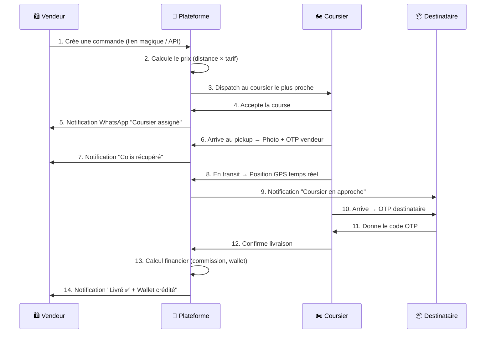

# 🚀 DELIVR-CM — Documentation Technique

> **La plateforme de livraison last-mile pour e-commerçants au Cameroun.**
> Connecte les vendeurs Instagram/Facebook de Douala & Yaoundé à un réseau de coursiers performants.

---

## 📋 Table des matières

- [Vue d'ensemble](#-vue-densemble)
- [Architecture](#-architecture)
- [Stack Technique](#-stack-technique)
- [Modules](#-modules)
- [Profils Utilisateur](./USER_PROFILES.md)
- [Parcours Utilisateur](./journeys/)
- [API Reference](./ARCHITECTURE.md)

---

## 🌍 Vue d'ensemble

DELIVR-CM est une plateforme SaaS de logistique last-mile conçue pour le marché camerounais. Elle permet :

| Pour qui ? | Quoi ? |
|---|---|
| 🛍️ **Vendeurs (Instagram/FB)** | Créer des livraisons en 2 clics via un lien magique ou une API |
| 🏍️ **Coursiers** | Recevoir, accepter et livrer des commandes via une app mobile |
| 👨‍💼 **Gestionnaires de flotte** | Superviser les coursiers, les finances et les performances |
| 👤 **Clients finaux** | Commander via un lien partagé, suivre en temps réel |

### Le pitch en 30 secondes

```
Un vendeur Instagram partage son lien DELIVR-CM sur WhatsApp.
Le client remplit l'adresse → Un coursier est assigné automatiquement.
Le vendeur suit tout en temps réel sur son dashboard.
Le coursier livre → Le wallet du vendeur est crédité.
Tout le monde est content 🎉
```

---

## 🏗️ Architecture

```
┌─────────────────────────────────────────────────────────────┐
│                    🌐 FRONT-END LAYER                       │
├──────────────┬──────────────┬──────────────┬────────────────┤
│  🏠 Landing  │  🛍️ Portail  │  🏍️ App      │  👨‍💼 Fleet      │
│  Page        │  Vendeur     │  Coursier    │  Manager       │
│  (home/)     │  (partners/) │  (courier/)  │  (fleet/)      │
│              │              │  + Flutter   │                │
└──────┬───────┴──────┬───────┴──────┬───────┴───────┬────────┘
       │              │              │               │
┌──────▼──────────────▼──────────────▼───────────────▼────────┐
│                    ⚙️ BACKEND LAYER (Django)                 │
├─────────┬──────────┬──────────┬──────────┬─────────┬────────┤
│  core/  │logistics/│ finance/ │partners/ │  bot/   │support/│
│ Users   │Deliveries│ Wallet   │ API Keys │WhatsApp │Disputes│
│ Auth    │Routing   │ Invoices │ Webhooks │  OTP    │Refunds │
│ Promo   │Tracking  │ Payments │ Notifs   │ Alerts  │        │
│ Badges  │Ratings   │Withdrawal│ Branding │         │        │
└─────────┴──────────┴──────────┴──────────┴─────────┴────────┘
       │              │              │               │
┌──────▼──────────────▼──────────────▼───────────────▼────────┐
│                    💾 DATA LAYER                             │
├─────────────────┬─────────────────┬─────────────────────────┤
│  🐘 PostgreSQL  │  🔴 Redis       │  📁 Media Storage       │
│  + PostGIS      │  Cache + WS     │  Photos, Docs, PDFs     │
└─────────────────┴─────────────────┴─────────────────────────┘
       │                    │
┌──────▼────────────────────▼─────────────────────────────────┐
│                  🌐 EXTERNAL SERVICES                        │
├──────────┬───────────┬───────────┬──────────┬───────────────┤
│ WhatsApp │ MTN MoMo  │  Orange   │  OSRM    │  Nominatim    │
│ (Twilio/ │  Money    │  Money    │ Routing  │  Geocoding    │
│  Meta)   │           │           │          │               │
└──────────┴───────────┴───────────┴──────────┴───────────────┘
```

---

## 🛠️ Stack Technique

| Composant | Technologie | Rôle |
|---|---|---|
| **Backend** | Django 5.2 + DRF | API REST + Portails web |
| **ASGI** | Daphne + Channels | WebSockets (tracking temps réel) |
| **Base de données** | PostgreSQL 15 + PostGIS | Données + Géospatial |
| **Cache / Broker** | Redis | Cache, WebSocket, Celery |
| **Tâches async** | Celery + Celery Beat | Notifications, Cron jobs |
| **Mobile** | Flutter (Dart) | App coursier iOS/Android |
| **Routing** | OSRM (self-hosted) | Calcul d'itinéraires |
| **Geocoding** | Nominatim (self-hosted) | Géocodage inversé |
| **Paiement** | MTN MoMo + Orange Money | Mobile Money |
| **Messaging** | Twilio / Meta WhatsApp | OTP, Notifications |
| **Conteneurs** | Docker Compose | Dev & Déploiement |

---

## 📦 Modules

L'application est organisée en **11 Django apps** indépendantes mais interconnectées :

### 🔑 Modules principaux

| Module | Rôle | Doc détaillée |
|---|---|---|
| `core/` | 👤 Utilisateurs, authentification, rôles, gamification | [→ core.md](./modules/core.md) |
| `logistics/` | 📦 Livraisons, quartiers, statuts, GPS, routing, ratings | [→ logistics.md](./modules/logistics.md) |
| `finance/` | 💰 Wallet, transactions, retraits, factures, paiements mobile | [→ finance.md](./modules/finance.md) |
| `partners/` | 🛍️ Portail vendeur (dashboard, commandes, analytics, webhooks) | [→ partners.md](./modules/partners.md) |

### 🏍️ Modules opérationnels

| Module | Rôle | Doc détaillée |
|---|---|---|
| `courier/` | 🏍️ App coursier (dashboard, revenus, badges, wallet) | [→ courier.md](./modules/courier.md) |
| `fleet/` | 👨‍💼 Administration des coursiers, live map, alertes | [→ fleet.md](./modules/fleet.md) |
| `bot/` | 🤖 WhatsApp Bot, notifications, rappels automatiques | [→ bot.md](./modules/bot.md) |

### 🛡️ Modules support

| Module | Rôle | Doc détaillée |
|---|---|---|
| `support/` | ⚖️ Litiges, remboursements | [→ support.md](./modules/support.md) |
| `reports/` | 📊 Génération PDF (factures, relevés) | [→ reports.md](./modules/reports.md) |
| `integrations/` | 🔌 API partenaires (WooCommerce, Shopify...) | [→ integrations.md](./modules/integrations.md) |
| `home/` | 🏠 Landing page, page de commande publique | [→ home.md](./modules/home.md) |

---

## 🔄 Flux principal — De la commande à la livraison



---

## 💰 Modèle financier

```
┌───────────────────────────────────────────────┐
│              CASH (P2P)                       │
│                                               │
│  Client  ──💵──►  Coursier (garde le cash)    │
│                      │                        │
│                      ├──20%──►  Plateforme     │
│                      │        (débité wallet)  │
│                      └──80%  =  gain coursier  │
└───────────────────────────────────────────────┘

┌───────────────────────────────────────────────┐
│           PRÉPAYÉ (Wallet Marchand)           │
│                                               │
│  Vendeur  ──debité──►  Plateforme             │
│                          │                    │
│                          ├──80%──►  Coursier   │
│                          │       (crédité)     │
│                          └──20%  =  commission │
└───────────────────────────────────────────────┘
```

- **Tarification** : Base `500 XAF` + `150 XAF/km`, minimum `1 000 XAF`
- **Commission** : 20% du prix total
- **Système de dette** : Les coursiers peuvent être en négatif (plafond par défaut : `-2 500 XAF`)
- **Kill Switch** : Si `wallet < -plafond` → coursier bloqué automatiquement

---

## 🚀 Démarrage rapide

```bash
# Cloner le projet
git clone <repo-url>
cd DELIVR-CM

# Configurer l'environnement
cp .env.example .env
# Éditer .env avec vos clés API

# Lancer avec Docker
docker-compose up -d

# Créer un superadmin
docker exec -it delivr_web python manage.py createsuperuser

# Accéder aux portails
# Landing Page:     http://localhost:8000/
# Admin Django:     http://localhost:8000/admin/
# Portail Vendeur:  http://localhost:8000/partners/login/
# App Coursier:    http://localhost:8000/courier/dashboard/
# Fleet Manager:   http://localhost:8000/fleet/
```

---

## 📖 Navigation de la doc

| Document | Description |
|---|---|
| [👤 USER_PROFILES.md](./USER_PROFILES.md) | Les 4 profils expliqués en détail |
| [🛍️ Parcours Vendeur](./journeys/vendeur_journey.md) | "La journée type d'un vendeur Instagram" |
| [🏍️ Parcours Coursier](./journeys/coursier_journey.md) | "La journée type d'un coursier DELIVR" |
| [📦 Parcours Client](./journeys/client_journey.md) | "Commander en 30 secondes" |
| [👨‍💼 Parcours Manager](./journeys/manager_journey.md) | "Piloter DELIVR-CM comme un chef d'orchestre" |
| [📦 Module Core](./modules/core.md) | Utilisateurs, Auth, Rôles |
| [📦 Module Logistics](./modules/logistics.md) | Livraisons, GPS, Routing |
| [📦 Module Finance](./modules/finance.md) | Wallet, Paiements, Factures |
| [📦 Module Partners](./modules/partners.md) | Portail Vendeur complet |
| [📦 Module Courier](./modules/courier.md) | App Coursier |
| [📦 Module Fleet](./modules/fleet.md) | Gestion de flotte |
| [📦 Module Bot](./modules/bot.md) | WhatsApp & Notifications |
| [📦 Module Support](./modules/support.md) | Litiges & Remboursements |

---

*Dernière mise à jour : Février 2026*
*Généré pour l'équipe DELIVR-CM 🇨🇲*
