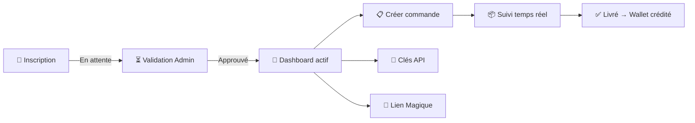
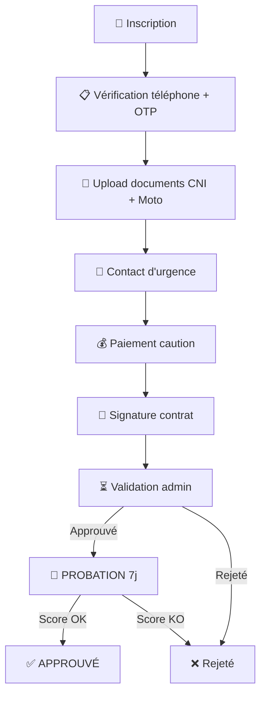

# 👤 Profils Utilisateur — DELIVR-CM

> Chaque utilisateur a un **rôle unique** qui détermine son accès, ses fonctionnalités et son interface.
> L'authentification se fait exclusivement par **numéro WhatsApp** (+237XXXXXXXXX).

---

## 🗺️ Vue d'ensemble des rôles

```
                    ┌──────────────┐
                    │   👑 ADMIN   │
                    │  Tout voir   │
                    │  Tout faire  │
                    └──────┬───────┘
                           │ supervise
              ┌────────────┼────────────┐
              │            │            │
      ┌───────▼──────┐ ┌──▼──────┐ ┌───▼──────────┐
      │ 👨‍💼 FLEET     │ │🛍️ BUSI- │ │ 🏍️ COURIER   │
      │ MANAGER     │ │  NESS   │ │              │
      │ (is_staff)  │ │         │ │              │
      └──────────────┘ └────┬────┘ └──────┬───────┘
                            │             │
                            │  crée des   │ livre les
                            │  commandes  │ commandes
                            │             │
                       ┌────▼─────────────▼───┐
                       │    👤 CLIENT          │
                       │    (destinataire)     │
                       └──────────────────────┘
```

---

## 👤 CLIENT (`UserRole.CLIENT`)

> *"Je commande un colis qu'on m'envoie — je n'ai même pas de compte."*

### 🎯 C'est qui ?
Le destinataire final. Il reçoit un **lien de commande** via WhatsApp/Instagram, remplit l'adresse de livraison, et attend son colis. Il n'a généralement **pas** de compte sur la plateforme.

### 🔓 Accès
| Interface | Accès |
|---|---|
| Page de commande publique | ✅ `/book/<slug>/` (sans login) |
| Suivi de livraison | ✅ Via lien WhatsApp |
| Portail partenaire | ❌ |
| App coursier | ❌ |
| Fleet Manager | ❌ |

### 📊 Données du profil

| Champ | Description |
|---|---|
| `phone_number` | Numéro WhatsApp (+237...) — identifiant unique |
| `full_name` | Nom complet |
| `role` | `CLIENT` |
| `wallet_balance` | Toujours `0.00` (pas de wallet actif) |

### 🎮 Interactions type
1. Reçoit un lien `/book/ma-boutique/` sur WhatsApp
2. Remplit : nom, téléphone, adresse de livraison
3. La commande est créée automatiquement
4. Reçoit un **OTP par WhatsApp** à la livraison
5. Donne le code au coursier → ✅ Livraison confirmée

---

## 🛍️ BUSINESS / VENDEUR (`UserRole.BUSINESS`)

> *"Je vends sur Instagram et j'utilise DELIVR-CM pour livrer à mes clients."*

### 🎯 C'est qui ?
L'e-commerçant. Vendeur sur les réseaux sociaux (Instagram, Facebook, WhatsApp) ou sur un site e-commerce. Il crée des commandes de livraison et suit ses performances.

### 🔓 Accès
| Interface | URL | Accès |
|---|---|---|
| Portail Vendeur (Dashboard) | `/partners/dashboard/` | ✅ |
| Mes Commandes | `/partners/orders/` | ✅ |
| Wallet & Finances | `/partners/wallet/` | ✅ |
| Analytiques Avancées | `/partners/analytics/` | ✅ |
| Configuration Webhooks | `/partners/webhooks/` | ✅ |
| Personnalisation (Branding) | `/partners/branding/` | ✅ |
| Factures | `/partners/invoices/` | ✅ |
| Suivi temps réel | `/partners/tracking/` | ✅ |
| Litiges | `/partners/disputes/` | ✅ |
| Notifications | `/partners/notifications/` | ✅ |
| Clés API | `/partners/dashboard/` | ✅ (après approbation) |
| Documentation API Swagger | `/partners/docs/` | ✅ |
| Lien magique public | `/book/<slug>/` | ✅ Auto-généré |
| App coursier | — | ❌ |
| Fleet Manager | — | ❌ |

### 📊 Données du profil

| Champ | Description | Exemple |
|---|---|---|
| `phone_number` | WhatsApp du vendeur | `+237677123456` |
| `full_name` | Nom / Nom de boutique | `Marie Fashion` |
| `role` | `BUSINESS` | — |
| `slug` | URL publique (auto-généré) | `marie-fashion` |
| `is_business_approved` | Validé par l'admin ? | `True/False` |
| `shop_logo` | Logo de la boutique | Image uploadée |
| `brand_color` | Couleur principale | `#00d084` |
| `business_type` | Type de commerce | `SOCIAL` / `WEB` / `BOTH` |
| `welcome_message` | Message d'accueil checkout | "Bienvenue chez Marie !" |
| `wallet_balance` | Solde disponible | `15 000 XAF` |
| `debt_ceiling` | Pas utilisé pour BUSINESS | `2 500 XAF` |

### 🎮 Parcours type



### 💡 Fonctionnalités clés

| Fonctionnalité | Description |
|---|---|
| **🔗 Lien Magique** | URL unique `/book/<slug>/` à partager sur les réseaux |
| **📊 Dashboard temps réel** | KPIs : commandes du jour, revenus, taux de livraison |
| **🔑 API REST** | Intégration WooCommerce/Shopify via clés API sécurisées |
| **🪝 Webhooks** | Callbacks HTTP sur `order.created`, `order.completed`, etc. |
| **🎨 Branding** | Personnalise la page de commande (logo, couleur, message) |
| **📈 Analytiques avancées** | Graphiques : évolution, heures de pointe, top quartiers |
| **🧾 Factures auto** | Génération PDF automatique par commande |
| **⚖️ Litiges** | Signaler un problème de livraison avec preuves photos |

---

## 🏍️ COURIER / COURSIER (`UserRole.COURIER`)

> *"Je suis sur ma moto, je livre des colis dans Douala et je gagne de l'argent."*

### 🎯 C'est qui ?
Le livreur. Il reçoit des commandes sur son téléphone, va chercher les colis et les livre aux destinataires. Il est rémunéré par course.

### 🔓 Accès
| Interface | URL | Accès |
|---|---|---|
| Dashboard coursier | `/courier/dashboard/` | ✅ |
| Mes Revenus | `/courier/earnings/` | ✅ |
| Performances | `/courier/performance/` | ✅ |
| Classement (Leaderboard) | `/courier/leaderboard/` | ✅ |
| Disponibilité | `/courier/availability/` | ✅ |
| Wallet & Retraits | `/courier/wallet/` | ✅ |
| Profil | `/courier/profile/` | ✅ |
| Badges & Succès | `/courier/badges/` | ✅ |
| Historique livraisons | `/courier/history/` | ✅ |
| App mobile Flutter | App native | ✅ |
| Portail vendeur | — | ❌ |
| Fleet Manager | — | ❌ |

### 📊 Données du profil

| Champ | Description | Exemple |
|---|---|---|
| `phone_number` | WhatsApp du coursier | `+237691234567` |
| `full_name` | Nom complet | `Jean Mbarga` |
| `role` | `COURIER` | — |
| `is_verified` | Documents vérifiés | `True/False` |
| `cni_document` | Photo CNI | Fichier uploadé |
| `moto_document` | Photo moto | Fichier uploadé |
| `onboarding_status` | Étape d'intégration | `PENDING → PROBATION → APPROVED` |
| `wallet_balance` | Solde (peut être **négatif** !) | `-1 200 XAF` |
| `debt_ceiling` | Plafond de dette | `2 500 XAF` |
| `is_online` | Disponible pour les courses ? | `True/False` |
| `last_location` | Position GPS en temps réel | Point géographique |
| `courier_level` | Niveau de gamification | `BRONZE → SILVER → GOLD → PLATINUM` |
| `total_deliveries_completed` | Compteur de livraisons | `247` |
| `total_distance_km` | Distance totale parcourue | `1 832.5 km` |
| `average_rating` | Note moyenne (/5) | `4.7` |
| `acceptance_rate` | Taux d'acceptation | `94.2%` |
| `consecutive_success_streak` | Série de succès en cours | `15` |
| `best_streak` | Record personnel | `42` |
| `trust_score` | Score de confiance (0-1) | `0.87` |
| `average_response_seconds` | Temps de réponse moyen | `45 sec` |
| `probation_delivery_limit` | Max livraisons/jour en probation | `10` |

### 🎮 Parcours d'onboarding



### ⚡ Système de gamification

```
  🥉 BRONZE          🥈 SILVER           🥇 GOLD          💎 PLATINUM
  ─────────────────────────────────────────────────────────────────────
  0-49 livraisons    50-199 livraisons   200-499           500+
  Note ≥ 3.0         Note ≥ 3.5          Note ≥ 4.0       Note ≥ 4.5
                     Streak ≥ 10         Streak ≥ 25       Streak ≥ 50
```

### 💰 Comment gagne-t-il de l'argent ?

```
┌──────────────────────────────────────────┐
│          LIVRAISON CASH (P2P)            │
│                                          │
│  Le client paie 2 000 XAF au coursier    │
│  → Coursier garde 2 000 XAF en cash      │
│  → Plateforme débite 400 XAF du wallet   │
│  → Gain net : 1 600 XAF                  │
│  (wallet peut devenir négatif !)         │
└──────────────────────────────────────────┘

┌──────────────────────────────────────────┐
│        LIVRAISON PRÉPAYÉE                │
│                                          │
│  Le vendeur a déjà payé                  │
│  → Coursier reçoit 1 600 XAF            │
│    directement sur son wallet            │
│  → Retire via MTN MoMo / Orange Money   │
└──────────────────────────────────────────┘
```

### ⚠️ Le système de dette expliqué

```
   Wallet: +500 XAF  → ✅ OK, peut livrer
   Wallet:    0 XAF  → ✅ OK, peut livrer  
   Wallet: -500 XAF  → ⚠️ Attention (notification WhatsApp)
   Wallet: -2500 XAF → ❌ BLOQUÉ ! (= debt_ceiling)
                         Ne peut plus recevoir de courses
                         Doit rembourser pour être réactivé
```

---

## 👑 ADMIN / STAFF (`UserRole.ADMIN`, `is_staff=True`)

> *"Je gère toute la plateforme : coursiers, vendeurs, finances, litiges."*

### 🎯 C'est qui ?
L'équipe DELIVR-CM. Administrateurs et gestionnaires de flotte qui supervisent l'ensemble de la plateforme.

### 🔓 Accès
| Interface | URL | Accès |
|---|---|---|
| Django Admin | `/admin/` | ✅ |
| Fleet Manager Dashboard | `/fleet/` | ✅ |
| Liste des coursiers | `/fleet/couriers/` | ✅ |
| Carte en direct | `/fleet/live-map/` | ✅ |
| Alertes & Monitoring | `/fleet/alerts/` | ✅ |
| Gestion des retraits | `/fleet/withdrawals/` | ✅ |
| Onboarding coursiers | `/fleet/onboarding/` | ✅ |
| Analytics avancées | `/fleet/analytics/` | ✅ |
| Finance globale | `/fleet/finance/` | ✅ |
| Rapports | `/fleet/reports/` | ✅ |
| Tout le reste | — | ✅ |

### 📊 Données du profil

| Champ | Description |
|---|---|
| `phone_number` | WhatsApp admin |
| `full_name` | Nom de l'admin |
| `role` | `ADMIN` |
| `is_staff` | `True` |
| `is_superuser` | `True` (pour le superadmin) |

### 💡 Pouvoirs spéciaux

| Action | Description |
|---|---|
| **Approuver un vendeur** | Active `is_business_approved` → donne accès aux clés API |
| **Approuver un coursier** | `onboarding_status = APPROVED` → peut recevoir des courses |
| **Bloquer un coursier** | Désactive le compte (trop de dette, conduite…) |
| **Ajuster le plafond** | Modifier `debt_ceiling` par coursier |
| **Résoudre un litige** | Enquête, remboursement, notes de résolution |
| **Gérer les retraits** | Approuver/rejeter les demandes de retrait Mobile Money |
| **Voir la carte live** | Position GPS de tous les coursiers en temps réel |
| **Créer des promos** | Codes promo avec conditions (%, montant fixe, dates) |

---

## 🔐 Matrice des permissions

| Fonctionnalité | 👤 CLIENT | 🛍️ BUSINESS | 🏍️ COURIER | 👑 ADMIN |
|---|:---:|:---:|:---:|:---:|
| Commander (page publique) | ✅ | ✅ | — | — |
| Créer des livraisons | — | ✅ | — | ✅ |
| Accepter des courses | — | — | ✅ | — |
| Voir son wallet | — | ✅ | ✅ | ✅ |
| Retirer vers MoMo/OM | — | — | ✅ | — |
| Clés API | — | ✅* | — | ✅ |
| Dashboard partenaire | — | ✅ | — | — |
| Dashboard coursier | — | — | ✅ | — |
| Fleet Manager | — | — | — | ✅ |
| Django Admin | — | — | — | ✅ |
| Résoudre litiges | — | — | — | ✅ |
| Carte live coursiers | — | — | — | ✅ |

*\* Après approbation admin (`is_business_approved = True`)*

---

## 🔄 Cycle de vie d'un utilisateur

### 🛍️ Vendeur
```
Inscription → ⏳ En attente → ✅ Approuvé → 🎯 Actif → (peut être désactivé)
                                    ↓
                            Accès au dashboard
                            Clés API activées
                            Lien magique généré
```

### 🏍️ Coursier
```
Inscription → 📄 Documents → 💰 Caution → 📜 Contrat → ⏳ Validation
                                                             ↓
                                                     🔄 PROBATION (7j)
                                                             ↓
                                                ┌─── Score OK ──→ ✅ APPROUVÉ
                                                └─── Score KO ──→ ❌ REJETÉ
```

---

*📖 Retour au [README principal](./README.md)*
