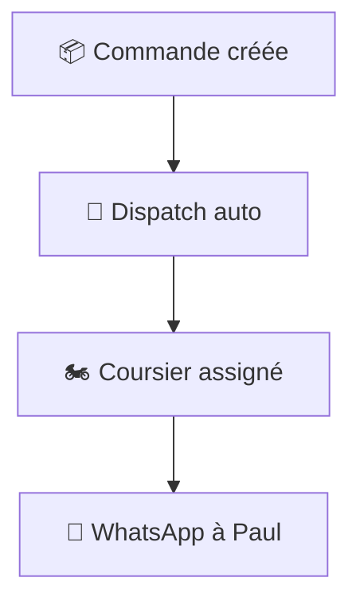

# 📦 Parcours Client — "Commander en 30 secondes"

> *Suivez Paul, client à Akwa (Douala), qui reçoit un bijou commandé chez Marie Fashion via DELIVR-CM.*

---

## 📖 L'histoire de Paul

Paul a vu un magnifique collier doré sur le compte Instagram de Marie Fashion. Il la contacte en DM : *"Je veux ce collier !"*

Marie lui envoie un lien. **Paul n'a pas besoin de télécharger d'app, ni de créer un compte.** Tout se passe via un simple lien web + WhatsApp.

---

## 📱 Étape 1 — Paul reçoit le lien (10 secondes)

Marie lui envoie sur WhatsApp :

```
💎 Marie Fashion Bijoux

Passez votre commande ici 👉
delivr-cm.com/book/marie-fashion-bijoux/
```

Paul clique sur le lien.

---

## 📝 Étape 2 — Il remplit le formulaire (20 secondes)

Paul voit la page de commande **personnalisée aux couleurs de Marie** (rose fuchsia, logo...) :

```
┌──────────────────────────────────────────┐
│  ✨ Marie Fashion Bijoux                 │
│  [Logo rose] 💎                          │
│                                          │
│  "Merci de commander chez Marie          │
│   Fashion ! Livraison express à Douala." │
│                                          │
│  ──────────────────────────────────────  │
│                                          │
│  👤 Votre nom                            │
│  ┌──────────────────────────────────┐   │
│  │ Paul Nkwi                        │   │
│  └──────────────────────────────────┘   │
│                                          │
│  📱 Votre WhatsApp                       │
│  ┌──────────────────────────────────┐   │
│  │ +237 677 987 654                  │   │
│  └──────────────────────────────────┘   │
│                                          │
│  📍 Quartier de livraison               │
│  ┌──────────────────────────────────┐   │
│  │ ▼ Akwa                           │   │
│  └──────────────────────────────────┘   │
│                                          │
│  🏠 Adresse exacte                       │
│  ┌──────────────────────────────────┐   │
│  │ Rue de l'Hôpital, 2ème étage    │   │
│  └──────────────────────────────────┘   │
│                                          │
│  📋 Instructions (optionnel)             │
│  ┌──────────────────────────────────┐   │
│  │ Sonnez à l'interphone, apt 4B   │   │
│  └──────────────────────────────────┘   │
│                                          │
│  ──────────────────────────────────────  │
│                                          │
│  💰 Frais de livraison : 1 500 XAF      │
│  📏 Distance estimée : 5.2 km           │
│  ⏱️ Délai estimé : 30-45 min            │
│                                          │
│  [🚀 Commander ma livraison]            │
│                                          │
│  Propulsé par DELIVR-CM 🇨🇲              │
└──────────────────────────────────────────┘
```

Paul clique **"Commander"** → ✅ Commande créée !

---

## ⏳ Étape 3 — Paul attend (il ne fait rien !)

Tout se passe automatiquement :



### Paul reçoit un WhatsApp :

```
📦 DELIVR-CM — Votre livraison

Bonjour Paul ! Votre commande de Marie Fashion est confirmée.

🏍️ Coursier : Jean Mbarga ⭐ 4.8
📱 Tél : 691 234 567
⏱️ Temps estimé : 35 min

Vous recevrez un code OTP à l'arrivée du coursier.
```

### Pendant ce temps...

```
     🏠 Marie                          📍 Paul (Akwa)
   (Bonamoussadi)                        
        │                                │
        │    🏍️ Jean                      │
        │     ↓                          │
        │  [Pickup chez Marie]           │
        │     ↓                          │
        │  [En transit...]    ──────────▶│
        │                                │
```

---

## 🔔 Étape 4 — Le coursier arrive

Paul reçoit un dernier WhatsApp :

```
🏍️ DELIVR-CM — Coursier en approche !

Jean Mbarga arrive dans ~3 minutes.

🔐 Votre code de livraison :

    ╔═══╗ ╔═══╗ ╔═══╗ ╔═══╗
    ║ 8 ║ ║ 3 ║ ║ 5 ║ ║ 6 ║
    ╚═══╝ ╚═══╝ ╚═══╝ ╚═══╝

Donnez ce code au coursier pour confirmer la réception.
⚠️ Ne partagez ce code qu'au coursier !
```

---

## ✅ Étape 5 — La livraison (30 secondes)

Jean sonne. Paul ouvre :

```
Jean : "Bonjour ! Livraison de Marie Fashion. Votre code ?"
Paul : "8-3-5-6"
Jean : *entre le code sur l'app* → ✅ VALIDÉ !
Jean : "C'est bon, bonne soirée !"
Paul : "Merci ! 🎉"
```

### Paul peut noter Jean :

```
┌──────────────────────────────────────┐
│  ⭐ Comment s'est passée la           │
│     livraison ?                       │
│                                      │
│     ⭐ ⭐ ⭐ ⭐ ⭐                    │
│                                      │
│  💬 Un commentaire ? (optionnel)     │
│  ┌────────────────────────────┐      │
│  │ Rapide et souriant, merci! │      │
│  └────────────────────────────┘      │
│                                      │
│  [✅ Envoyer]                        │
└──────────────────────────────────────┘
```

---

## ⏱️ Résumé — Expérience en chiffres

| Action | Temps |
|---|---|
| Recevoir le lien | 0 sec (Marie l'envoie) |
| Remplir le formulaire | ~20 sec |
| Attente automatique | ~30 min |
| Donner le code OTP | ~10 sec |
| **Total effort de Paul** | **~30 secondes** |

### Ce que Paul N'a PAS eu à faire :

- ❌ Installer une app
- ❌ Créer un compte
- ❌ Entrer un mot de passe
- ❌ Saisir une carte bancaire
- ❌ Appeler un standard téléphonique
- ❌ Chercher un coursier manuellement

---

## 🔐 La sécurité pour Paul

| Protection | Comment |
|---|---|
| **OTP de livraison** | Le colis n'est remis que si Paul donne le bon code |
| **Photo du colis** | Le coursier prend une photo au pickup (preuve) |
| **Suivi GPS** | La position du coursier est trackée en continu |
| **Coursier vérifié** | CNI + moto vérifiés, période de probation passée |
| **Litiges** | Paul peut signaler un problème (colis abîmé, non reçu...) |

---

## 📦 Modules impliqués

| Étape | Module(s) | Fichiers clés |
|---|---|---|
| Page publique | `home/` | `PublicShopView` |
| Calcul du prix | `logistics/` | `services/pricing.py` |
| Création commande | `logistics/` | `Delivery` model |
| Dispatch coursier | `logistics/` | `services/dispatch.py` |
| Notifications WhatsApp | `bot/` | `tasks.py` |
| OTP | `core/` | OTP generation |
| Confirmation livraison | `logistics/`, `courier/` | Status update |
| Rating | `logistics/` | `Rating` model |

---

*📖 Retour au [README principal](../README.md) | Voir aussi : [🛍️ Parcours Vendeur](./vendeur_journey.md) | [🏍️ Parcours Coursier](./coursier_journey.md)*
