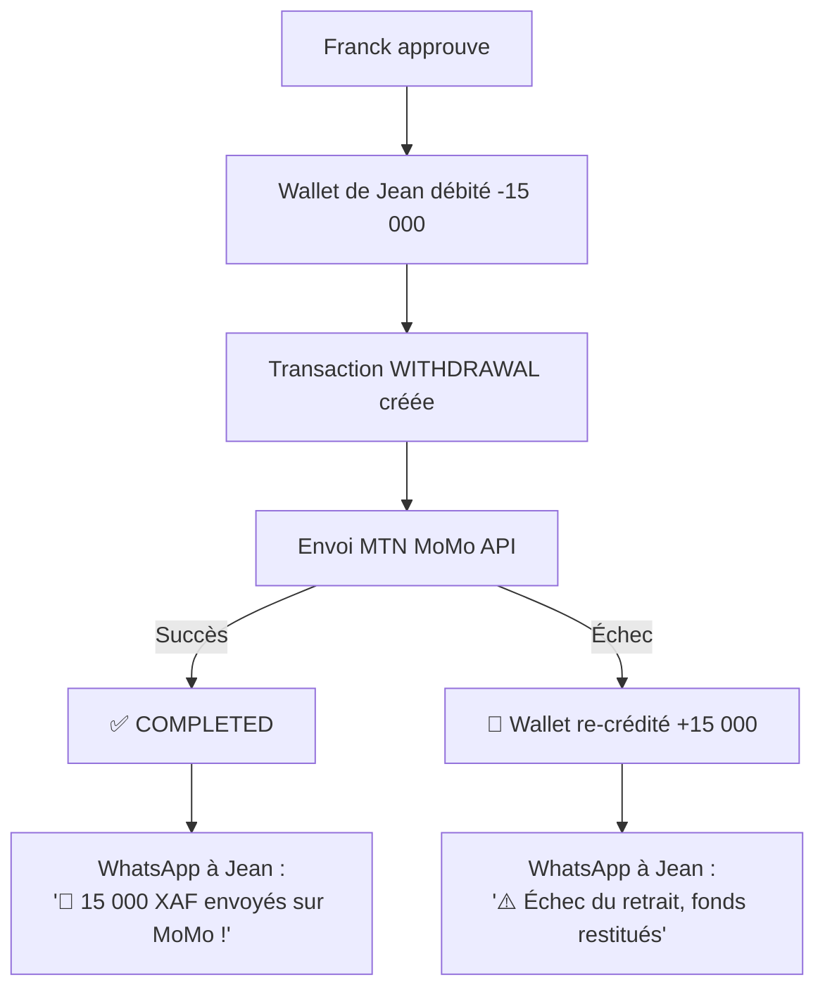

# 👨‍💼 Parcours Manager — "Piloter DELIVR-CM comme un chef d'orchestre"

> *Suivez Franck, responsable opérations chez DELIVR-CM à Douala, dans sa journée de supervision.*

---

## 📖 L'histoire de Franck

Franck a 31 ans. Il a rejoint DELIVR-CM il y a 6 mois comme responsable des opérations. Son job : s'assurer que **tout tourne**. Que les coursiers livrent, que les vendeurs soient contents, que l'argent circule, et que les problèmes soient réglés avant que qui que ce soit ne s'en aperçoive.

Son arme secrète ? Le **Fleet Manager** — un tableau de bord qui lui donne le pouvoir de tout voir et tout contrôler.

---

## ☀️ 7h30 — Le check-up matinal

Franck ouvre son laptop, un café à la main. Direction : `delivr-cm.com/fleet/`

### Le Dashboard (sa page d'accueil)

```
┌──────────────────────────────────────────────────────────────┐
│  👨‍💼 Fleet Manager — Vue d'ensemble                          │
│                                                              │
│  ┌────────────┐ ┌────────────┐ ┌────────────┐ ┌────────────┐│
│  │ 🏍️ 14/52   │ │ 📦 3       │ │ ⚠️ 2       │ │ 💰 127K    ││
│  │ coursiers  │ │ courses    │ │ alertes    │ │ XAF        ││
│  │ en ligne   │ │ en attente │ │ actives    │ │ revenus/j  ││
│  └────────────┘ └────────────┘ └────────────┘ └────────────┘│
│                                                              │
│  📈 Tendance semaine                                         │
│  L: 85  M: 92  M: 78  J: 103  V: 110  S: 95  D: 42        │
│  ▓▓▓▓  ▓▓▓▓▓ ▓▓▓▓  ▓▓▓▓▓▓ ▓▓▓▓▓▓ ▓▓▓▓▓ ▓▓                │
│                                                              │
│  ⚡ Actions rapides                                          │
│  [📋 Onboarding (3 en attente)]                             │
│  [💳 Retraits (5 à traiter)]                                │
│  [⚖️ Litiges (1 nouveau)]                                   │
└──────────────────────────────────────────────────────────────┘
```

Franck voit immédiatement :
- **14 coursiers en ligne** — Correct pour 7h30, ça monte vers 9h
- **3 courses en attente** — Pas de coursier dispo dans certains quartiers
- **2 alertes** — Il va vérifier
- **127K XAF de revenus** hier — En hausse 📈

> **En coulisses** : Le dashboard fait des appels AJAX toutes les 30 secondes vers `/fleet/api/stats/` pour rafraîchir les données en temps réel.

---

## 🗺️ 7h45 — La carte en direct

Franck clique sur **🗺️ Carte en direct** (`/fleet/live-map/`)

```
┌──────────────────────────────────────────────────────────────┐
│  🗺️ Carte en direct — Coursiers                              │
│                                                              │
│         Bonamoussadi           Akwa                          │
│        🏍️🏍️🏍️              🏍️                           │
│                                                              │
│              Bonapriso                                        │
│             🏍️🏍️                                           │
│                                                              │
│                    Bali         Deïdo                         │
│                   🏍️          🏍️🏍️                        │
│                                                              │
│         New-Bell                 Makepe                       │
│                               🏍️🏍️🏍️🏍️                  │
│                                                              │
│  ─────────────────────────────────────────                   │
│  🟢 En ligne (14)  🟡 En course (8)  🔴 Hors ligne (30)    │
│                                                              │
│  ⚠️ Zone sous-couverte : Akwa (1 seul coursier)             │
│  💡 Suggestion : Envoyer une notification aux coursiers      │
│     proches pour les inciter à se déplacer vers Akwa         │
└──────────────────────────────────────────────────────────────┘
```

Franck remarque :
- **Akwa n'a qu'un seul coursier** — C'est un quartier très actif le matin
- **Makepe est bien couvert** — 4 coursiers, ça suffit
- **New-Bell est vide** — Normal, peu de commandes là-bas

> **Action** : Franck note mentalement qu'il faut recruter des coursiers qui vivent à Akwa. Il regardera la couverture plus en détail tout à l'heure.

---

## ⚠️ 8h00 — Les alertes

Franck consulte les **2 alertes actives** (`/fleet/alerts/`)

```
┌──────────────────────────────────────────────────────────────┐
│  ⚠️ Alertes actives (2)                                      │
│                                                              │
│  ┌────────────────────────────────────────────────────────┐  │
│  │ 🔴 CRITIQUE — Dette critique                           │  │
│  │ Coursier : Samuel Tabi                                  │  │
│  │ Wallet : -2 350 XAF (plafond : -2 500)                 │  │
│  │ Dernière course : il y a 2h                             │  │
│  │                                                         │  │
│  │ 💡 Ce coursier est à 150 XAF du blocage automatique.   │  │
│  │                                                         │  │
│  │ [📱 Contacter par WhatsApp] [🔧 Ajuster plafond]       │  │
│  │ [✅ Marquer comme traité]                               │  │
│  └────────────────────────────────────────────────────────┘  │
│                                                              │
│  ┌────────────────────────────────────────────────────────┐  │
│  │ 🟡 ATTENTION — Coursier inactif                        │  │
│  │ Coursier : Marc Essono                                  │  │
│  │ Dernière connexion : il y a 5 jours                     │  │
│  │ Status : APPROUVÉ mais ne se met plus en ligne          │  │
│  │                                                         │  │
│  │ [📱 Contacter] [✅ Marquer comme traité]                │  │
│  └────────────────────────────────────────────────────────┘  │
└──────────────────────────────────────────────────────────────┘
```

### Gestion de l'alerte Samuel (dette critique)

Franck décide d'appeler Samuel :

```
📞 Franck : "Samuel, ton solde est à -2 350 XAF. 
    Si tu fais une course de plus sans rembourser, 
    ton compte sera bloqué automatiquement."
    
📞 Samuel : "Oui chef, j'ai de l'argent sur moi. 
    Je passe au bureau déposer 5 000 XAF aujourd'hui."
    
📞 Franck : "OK, je te laisse jusqu'à ce soir. 
    Sinon je devrai ajuster ton plafond."
```

> **Option B** : Si Samuel est un bon coursier, Franck peut **augmenter temporairement son plafond** de dette (`/fleet/couriers/<id>/adjust-debt/`) pour lui laisser plus de marge.

---

## 📋 8h30 — L'onboarding des nouveaux coursiers

Franck voit **3 candidats en attente** (`/fleet/onboarding/`)

```
┌──────────────────────────────────────────────────────────────┐
│  📋 Onboarding — Candidats en attente (3)                    │
│                                                              │
│  ┌──────────────────────────────────────────────────────┐   │
│  │ #1 — Pierre Kamga                                     │   │
│  │ 📱 +237 677 111 222                                   │   │
│  │ 📄 CNI : ✅ Nette, lisible                            │   │
│  │ 🏍️ Moto : ✅ En bon état                             │   │
│  │ 👥 Contact urgence : ✅ Mère — 699 333 444           │   │
│  │ 💰 Caution : ✅ Payée                                 │   │
│  │ 📜 Contrat : ✅ Signé                                 │   │
│  │                                                       │   │
│  │ [✅ Approuver → PROBATION] [❌ Rejeter]               │   │
│  └──────────────────────────────────────────────────────┘   │
│                                                              │
│  ┌──────────────────────────────────────────────────────┐   │
│  │ #2 — Alice Ngo                                        │   │
│  │ 📱 +237 691 555 666                                   │   │
│  │ 📄 CNI : ⚠️ Photo floue, illisible                   │   │
│  │ 🏍️ Moto : ✅ OK                                      │   │
│  │                                                       │   │
│  │ [❌ Rejeter — CNI illisible]                          │   │
│  │ [📱 Demander une nouvelle photo]                      │   │
│  └──────────────────────────────────────────────────────┘   │
│                                                              │
│  ┌──────────────────────────────────────────────────────┐   │
│  │ #3 — Yves Fotso                                       │   │
│  │ 📱 +237 677 777 888                                   │   │
│  │ 📄 CNI : ✅ OK     🏍️ Moto : ✅ OK                   │   │
│  │ 👥 Urgence : ✅ OK  💰 Caution : ✅ OK               │   │
│  │ 📜 Contrat : ✅ Signé                                 │   │
│  │                                                       │   │
│  │ [✅ Approuver → PROBATION] [❌ Rejeter]               │   │
│  └──────────────────────────────────────────────────────┘   │
└──────────────────────────────────────────────────────────────┘
```

### Les décisions de Franck

| Candidat | Décision | Action |
|---|---|---|
| Pierre Kamga | ✅ **Approuvé** | → Passe en PROBATION (7 jours, max 10 courses/jour) |
| Alice Ngo | 🔄 **En attente** | → WhatsApp : "Renvoyez une photo CNI plus nette" |
| Yves Fotso | ✅ **Approuvé** | → Passe en PROBATION |

> **En coulisses** : Quand Franck clique "Approuver", le `onboarding_status` passe de `PENDING` à `PROBATION`. Le `probation_start_date` est set à aujourd'hui, et `probation_end_date` dans 7 jours. Le coursier reçoit un WhatsApp : *"🎉 Bienvenue chez DELIVR-CM ! Vous êtes en période d'essai."*

---

## 💳 10h00 — Les demandes de retrait

Franck traite les **5 demandes de retrait** en attente (`/fleet/withdrawals/`)

```
┌──────────────────────────────────────────────────────────────┐
│  💳 Retraits Mobile Money — En attente (5)                   │
│                                                              │
│  # │ Coursier        │ Montant    │ Vers          │ Solde    │
│  ──┼─────────────────┼────────────┼───────────────┼──────────│
│  1 │ Jean Mbarga     │ 15 000 XAF │ MTN MoMo      │ 23 400  │
│  2 │ André Mouthe    │  8 000 XAF │ Orange Money  │ 12 100  │
│  3 │ Pierre Kamga    │  3 000 XAF │ MTN MoMo      │  3 200  │
│  4 │ Samuel Tabi     │ 10 000 XAF │ MTN MoMo      │ -2 350  │ ⚠️
│  5 │ Eric Bodo       │ 50 000 XAF │ Orange Money  │ 51 200  │
│                                                              │
│  Actions : [✅ Approuver] [❌ Rejeter] [📋 Détails]         │
└──────────────────────────────────────────────────────────────┘
```

### Les décisions de Franck

| # | Décision | Raison |
|---|---|---|
| 1 | ✅ **Approuvé** | Solde suffisant, coursier fiable |
| 2 | ✅ **Approuvé** | OK |
| 3 | ✅ **Approuvé** | Petit montant, solde OK |
| 4 | ❌ **Rejeté** | *"Solde négatif ! Samuel doit d'abord rembourser sa dette."* |
| 5 | ✅ **Approuvé** | Gros montant mais solde très confortable |

### Le flux en coulisses



> **Sécurité** : Le système vérifie automatiquement que le coursier a un solde suffisant. Même si Franck essayait d'approuver le retrait de Samuel, le `WithdrawalService` refuserait car `solde (-2 350) < montant (10 000)`.

---

## 🛍️ 11h00 — Approuver un nouveau vendeur

Franck reçoit une notif : une nouvelle vendeuse s'est inscrite.

```
┌──────────────────────────────────────────────────────────────┐
│  🛍️ Nouveau partenaire — En attente de validation            │
│                                                              │
│  👤 Sarah Beauty Cam                                         │
│  📱 +237 699 123 456                                         │
│  📦 Type : Réseaux Sociaux (Instagram)                       │
│  🔗 Instagram : @sarah_beauty_cam (12.5K followers)          │
│                                                              │
│  Franck vérifie :                                            │
│  ✅ Le compte Instagram existe et est actif                  │
│  ✅ Elle a des vrais abonnés (pas de bots)                   │
│  ✅ Elle vend des produits physiques (cosmétiques)            │
│                                                              │
│  → Franck active is_business_approved = True                 │
│  → Sarah peut maintenant :                                   │
│     • Accéder au dashboard complet                           │
│     • Générer des clés API                                   │
│     • Utiliser son lien magique /book/sarah-beauty-cam/      │
└──────────────────────────────────────────────────────────────┘
```

Sarah reçoit un WhatsApp :
```
🎉 DELIVR-CM — Compte Activé !

Bonjour Sarah ! Votre compte vendeur est maintenant actif.

🔗 Votre lien magique : delivr-cm.com/book/sarah-beauty-cam/
📊 Votre dashboard : delivr-cm.com/partners/dashboard/

Partagez votre lien avec vos clients pour commencer à livrer ! 🚀
```

---

## ⚖️ 14h00 — Résoudre un litige

Un vendeur a signalé un problème. Franck ouvre le litige :

```
┌──────────────────────────────────────────────────────────────┐
│  ⚖️ Litige #a4c2 — ITEM_DAMAGED                              │
│                                                              │
│  📅 Créé : Aujourd'hui à 11h42                               │
│  📦 Commande : DLV-X8F2K9                                   │
│  🛍️ Vendeur : Marie Fashion Bijoux                          │
│  🏍️ Coursier : André Mouthe                                 │
│  👤 Client : Paul Nkwi                                       │
│                                                              │
│  ──────────────────────────────────────────────────────────  │
│                                                              │
│  📝 Description du vendeur :                                 │
│  "Le client m'a envoyé une photo, le bijou est arrivé        │
│   cassé. La boîte était écrasée. Je pense que le coursier    │
│   a mal transporté le colis."                                │
│                                                              │
│  📸 Preuve(s) :                                              │
│  [photo_bijou_casse.jpg] [photo_boite_ecrasee.jpg]          │
│                                                              │
│  ──────────────────────────────────────────────────────────  │
│                                                              │
│  🔍 Investigation de Franck :                                │
│                                                              │
│  → Vérifie la photo de pickup (prise par André)              │
│    📸 Le bijou était intact au retrait ✅                    │
│  → Vérifie la photo du client                                │
│    📸 La boîte est effectivement écrasée ⚠️                 │
│  → Vérifie le trajet GPS d'André                             │
│    🗺️ Rien d'anormal, mais le colis a pu être               │
│       mal calé dans le sac à dos                             │
│                                                              │
│  ──────────────────────────────────────────────────────────  │
│                                                              │
│  📋 Décision :                                               │
│  Statut : [✅ RESOLVED ▼]                                   │
│  Note : "Colis endommagé pendant le transport.               │
│          Photo de pickup confirme que le colis était          │
│          intact au retrait. Remboursement partiel             │
│          accordé au vendeur."                                │
│                                                              │
│  💰 Remboursement : [1 000] XAF (sur 1 500)                 │
│                                                              │
│  [📱 Avertir le coursier André]                              │
│  [💰 Procéder au remboursement]                              │
└──────────────────────────────────────────────────────────────┘
```

### Ce qui se passe quand Franck clique "Procéder au remboursement"

```
1. Dispute.status → RESOLVED
2. Dispute.refund_amount → 1 000 XAF
3. Dispute.resolved_by → Franck
4. Refund créé → 1 000 XAF
5. Transaction REFUND → Wallet de Marie crédité +1 000 XAF
6. WhatsApp → Marie : "Votre litige a été résolu. 1 000 XAF remboursés."
7. WhatsApp → André : "⚠️ Un litige a été signalé sur votre livraison DLV-X8F2K9.
   Veillez à bien protéger les colis fragiles."
```

---

## 📊 15h00 — Les analytics

Franck consulte les **statistiques globales** (`/fleet/analytics/`)

```
┌──────────────────────────────────────────────────────────────┐
│  📊 Analytics Fleet — 30 derniers jours                      │
│                                                              │
│  📦 Livraisons total     💰 Revenus plateforme               │
│     2 847                   1 523 400 XAF                    │
│     ↑ +12% vs mois préc.   ↑ +15% vs mois préc.             │
│                                                              │
│  ✅ Taux de succès        ⏱️ Temps moyen livraison           │
│     94.7%                    32 min                           │
│     ↑ +1.2% amélioration    ↓ -3 min (plus rapide !)        │
│                                                              │
│  ──────────────────────────────────────────────────────────  │
│                                                              │
│  🏍️ Performance coursiers                                    │
│  ┌───────────────────────────────────────────────────────┐  │
│  │ Niveau    │ Nombre │ % de la flotte │ Note moy.      │  │
│  │───────────┼────────┼────────────────┼────────────────│  │
│  │ 💎 Plat. │    3   │     5.8%       │    4.9         │  │
│  │ 🥇 Gold  │   12   │    23.1%       │    4.6         │  │
│  │ 🥈 Silver│   18   │    34.6%       │    4.3         │  │
│  │ 🥉 Bronze│   19   │    36.5%       │    3.8         │  │
│  └───────────────────────────────────────────────────────┘  │
│                                                              │
│  🗺️ Top 5 quartiers (volume)                                │
│  1. 🏆 Akwa           — 487 livraisons (17.1%)              │
│  2. 🥈 Bonapriso      — 412 livraisons (14.5%)              │
│  3. 🥉 Bonamoussadi   — 389 livraisons (13.7%)              │
│  4.    Makepe          — 301 livraisons (10.6%)              │
│  5.    Deïdo           — 267 livraisons  (9.4%)              │
│                                                              │
│  ⚠️ Quartiers sous-couverts (demande > offre)                │
│  • Logbessou (forte demande, 0 coursier résident)            │
│  • Ndogbong (demande croissante +25% ce mois)                │
│                                                              │
│  📈 Évolution journalière                                    │
│  ╭──╮    ╭──╮                                               │
│  │  ╰──╮ │  ╰──╮ ╭──╮                                      │
│  │     ╰─╯     ╰─╯  │                                      │
│  ╰───────────────────╯                                      │
│  01/02        08/02        15/02                             │
└──────────────────────────────────────────────────────────────┘
```

### Ce que Franck en tire

| Observation | Décision |
|---|---|
| Bronze = 36.5% de la flotte | "Il faut accompagner les Bronze pour qu'ils montent Silver" |
| Akwa = top quartier | "Bien couvert, mais on peut optimiser les temps de réponse" |
| Logbessou = sous-couvert | "Lancer une campagne de recrutement dans ce quartier" |
| Temps moyen ↓ 3 min | "Le routing intelligent fonctionne 💪" |

---

## 🗺️ 16h00 — La couverture géographique

Franck ouvre **🗺️ Couverture** (`/fleet/coverage/`) pour une vue macro :

```
┌──────────────────────────────────────────────────────────────┐
│  🗺️ Couverture — Carte de chaleur                            │
│                                                              │
│  Douala                                                      │
│  ████████████████████████████████████████                    │
│  ██████ 🟢🟢🟢🟢🟢 ████████████████                        │
│  ██ 🟢🟢🟢🟢🟢🟢🟢🟢🟢 ██████████                        │
│  █ 🟢🟢🟢🟡🟡🟡🟢🟢🟢🟢 █████████                        │
│  █ 🟢🟢🟡🟡🔴🔴🟡🟢🟢🟢 █████████                        │
│  ██ 🟢🟡🟡🔴🔴🟡🟡🟢🟢 ██████████                        │
│  ███ 🟡🟡🟡🟡🟡🟡🟢🟢 ███████████                        │
│  █████ 🟡🟡🟡🟡🟡 ████████████████                        │
│  ████████████████████████████████████████                    │
│                                                              │
│  Légende :                                                   │
│  🟢 Bien couvert (≥3 coursiers, temps < 15 min)             │
│  🟡 Couverture moyenne (1-2 coursiers, temps 15-30 min)     │
│  🔴 Sous-couvert (0 coursier, temps > 30 min)               │
│                                                              │
│  💡 Recommandation : Recruter 4-5 coursiers dans les        │
│     zones rouges pour atteindre une couverture uniforme.     │
└──────────────────────────────────────────────────────────────┘
```

---

## 👤 17h00 — Vérifier un coursier en probation

Pierre Kamga (approuvé ce matin) a fait ses premières courses. Franck consulte son profil (`/fleet/couriers/<id>/`) :

```
┌──────────────────────────────────────────────────────────────┐
│  👤 Pierre Kamga — Profil coursier                            │
│                                                              │
│  📱 +237 677 111 222                                         │
│  🏍️ Statut : 🔄 PROBATION (Jour 1/7)                       │
│  📊 Trust Score : 0.72 / 1.0                                │
│                                                              │
│  ── Statistiques (probation) ──────────────────────────────  │
│                                                              │
│  📦 Courses complétées : 6 / 10 max par jour                │
│  ✅ Taux de succès : 100% (6/6)                              │
│  ⏱️ Temps de réponse : 28 sec (excellent !)                  │
│  ⭐ Note moyenne : 4.8 / 5                                   │
│  ❌ Annulations : 0                                           │
│                                                              │
│  ── Documents ──────────────────────────────────────────────  │
│  📄 CNI : ✅ Vérifiée                                        │
│  🏍️ Moto : ✅ Vérifiée                                      │
│                                                              │
│  ── Actions ────────────────────────────────────────────────  │
│  [✅ Passer en APPROUVÉ]  (disponible dans 6 jours)          │
│  [❌ Rejeter]                                                │
│  [🔧 Ajuster plafond dette]                                  │
│  [📱 Contacter par WhatsApp]                                 │
│  [🚫 Bloquer le compte]                                      │
└──────────────────────────────────────────────────────────────┘
```

Franck est satisfait : 6/6 courses réussies, note 4.8, temps de réponse rapide. Pierre est sur la bonne voie. 👍

---

## 💰 18h00 — Le dashboard financier

Fin de journée, Franck consulte la **finance globale** (`/fleet/finance/`)

```
┌──────────────────────────────────────────────────────────────┐
│  💰 Finance — Vue d'ensemble                                 │
│                                                              │
│  📅 Aujourd'hui                📅 Ce mois                    │
│  ┌────────────────┐           ┌────────────────┐            │
│  │ 💵 142 300 XAF │           │ 💵 3 245 000   │            │
│  │ revenus bruts  │           │ revenus bruts   │            │
│  │                │           │                 │            │
│  │ 📊 28 460 XAF  │           │ 📊 649 000     │            │
│  │ commission 20% │           │ commission 20%  │            │
│  └────────────────┘           └────────────────┘            │
│                                                              │
│  ── Retraits du jour ──────────────────────────────────────  │
│  ✅ Approuvés : 4       💸 Total : 76 000 XAF               │
│  ❌ Rejetés : 1         ⏳ En attente API : 2                │
│                                                              │
│  ── Santé des wallets ─────────────────────────────────────  │
│  Total soldes coursiers :  +187 500 XAF (net positif ✅)     │
│  Coursiers en dette :      7 / 52 (13.5%)                    │
│  Dette totale :            -12 800 XAF                       │
│  Risque blocage :          2 coursiers proches du plafond    │
│                                                              │
│  ── Top 5 revenus coursiers (ce mois) ─────────────────────  │
│  1. Jean Mbarga      💰 87 200 XAF   📦 54 courses          │
│  2. André Mouthe     💰 72 400 XAF   📦 45 courses          │
│  3. Eric Bodo        💰 68 100 XAF   📦 42 courses          │
│  4. Pierre K. (new)  💰  9 600 XAF   📦  6 courses          │
│  5. Marc Essono      💰  8 200 XAF   📦  5 courses ⚠️      │
└──────────────────────────────────────────────────────────────┘
```

### Insights de Franck

| Métrique | Analyse |
|---|---|
| Commission 20% = 28 460 XAF/jour | "~855K/mois de revenus plateforme, en croissance" |
| 7 coursiers en dette | "Acceptable (13%), mais à surveiller" |
| Jean = top performer | "Il mérite une prime ou un bonus fin de mois" |
| Marc = 5 courses seulement | "Il était actif, mais l'alerte dit 5j hors ligne — à relancer" |

---

## 📄 19h00 — Le rapport hebdomadaire

Franck génère un rapport depuis `/fleet/reports/` :

```
┌──────────────────────────────────────────────────────────────┐
│  📄 Rapport Hebdomadaire — DELIVR-CM                         │
│  Semaine du 5 au 11 Février 2026                             │
│                                                              │
│  📦 OPÉRATIONS                                               │
│  • 605 livraisons (+12% vs S-1)                              │
│  • Taux de succès : 94.7%                                    │
│  • Temps moyen : 32 min                                      │
│  • Top jour : Vendredi (110 courses)                         │
│                                                              │
│  💰 FINANCE                                                   │
│  • Revenus bruts : 908 500 XAF                               │
│  • Commission plateforme : 181 700 XAF                       │
│  • Retraits traités : 342 000 XAF                            │
│                                                              │
│  🏍️ FLOTTE                                                   │
│  • 52 coursiers actifs                                       │
│  • 2 nouveaux (Pierre, Yves)                                 │
│  • 1 en probation (Pierre)                                   │
│  • 7 en dette (13.5%)                                        │
│                                                              │
│  🛍️ PARTENAIRES                                              │
│  • 1 nouveau partenaire (Sarah Beauty)                       │
│  • 23 partenaires actifs                                     │
│                                                              │
│  ⚖️ LITIGES                                                   │
│  • 2 litiges cette semaine                                   │
│  • 1 résolu (remboursement 1 000 XAF)                        │
│  • 1 en investigation                                        │
│                                                              │
│  [📥 Télécharger PDF]                                        │
└──────────────────────────────────────────────────────────────┘
```

---

## 💡 Résumé — La boîte à outils de Franck

### Ce qu'il fait chaque jour

| Tâche | Fréquence | Temps | Impact |
|---|---|---|---|
| Check-up dashboard | 2-3x/jour | 2 min | Détection précoce des problèmes |
| Carte en direct | 3-4x/jour | 5 min | Couverture géographique |
| Alertes | En continu | 1-10 min | Prévenir les blocages |
| Onboarding | 1x/jour | 10 min | Croissance de la flotte |
| Retraits | 1-2x/jour | 15 min | Satisfaction des coursiers |
| Vendeurs | 1x/jour | 5 min | Croissance business |
| Litiges | Au besoin | 15-30 min | Qualité de service |
| Analytics | 1x/sem | 15 min | Stratégie et optimisation |
| Rapport | 1x/sem | 5 min | Communication direction |

### Ses super-pouvoirs

| Pouvoir | Quand l'utiliser |
|---|---|
| 🟢 **Approuver un coursier** | Dossier complet + CNI nette |
| 🔴 **Bloquer un coursier** | Comportement inacceptable, fraude |
| 💰 **Ajuster la dette** | Coursier de confiance qui a besoin de marge |
| 💳 **Approuver un retrait** | Solde suffisant, coursier légitime |
| ⚖️ **Résoudre un litige** | Preuves analysées, décision équitable |
| 🛍️ **Activer un vendeur** | Profil vérifié, business légitime |
| 📊 **Analyser les données** | Optimiser la couverture et les performances |

---

## 📦 Modules impliqués

| Étape | Module(s) | Fichiers clés |
|---|---|---|
| Dashboard | `fleet/` | `views.py` (DashboardView) |
| Carte live | `fleet/` | `views.py` (LiveMapView) + JS WebSocket |
| Alertes | `fleet/` | `views.py` (AlertsView) + `bot/` tasks |
| Onboarding | `fleet/`, `core/` | `views.py` (OnboardingAdminView) |
| Retraits | `fleet/`, `finance/` | `WithdrawalService` |
| Approbation vendeur | `core/` (admin) | `is_business_approved` |
| Litiges | `support/`, `finance/` | `Dispute`, `Refund`, `WalletService` |
| Analytics | `fleet/` | `views.py` (AnalyticsView) |
| Finance | `fleet/`, `finance/` | `views.py` (FinanceDashboardView) |
| Rapports | `fleet/`, `reports/` | PDF generation |

---

*📖 Retour au [README principal](../README.md) | Voir aussi : [🛍️ Parcours Vendeur](./vendeur_journey.md) | [🏍️ Parcours Coursier](./coursier_journey.md) | [📦 Parcours Client](./client_journey.md)*
