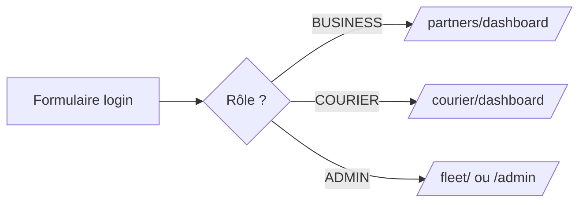
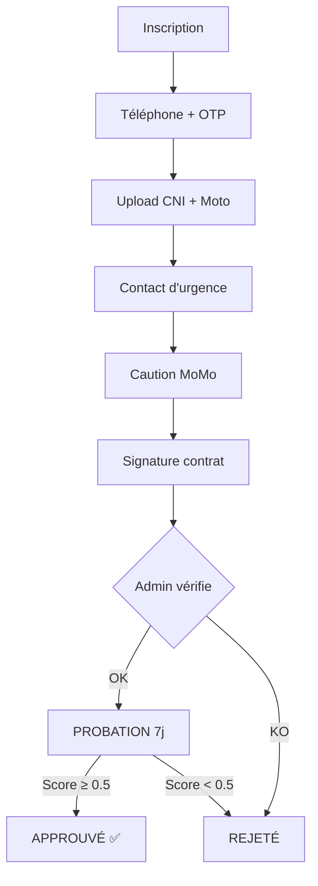
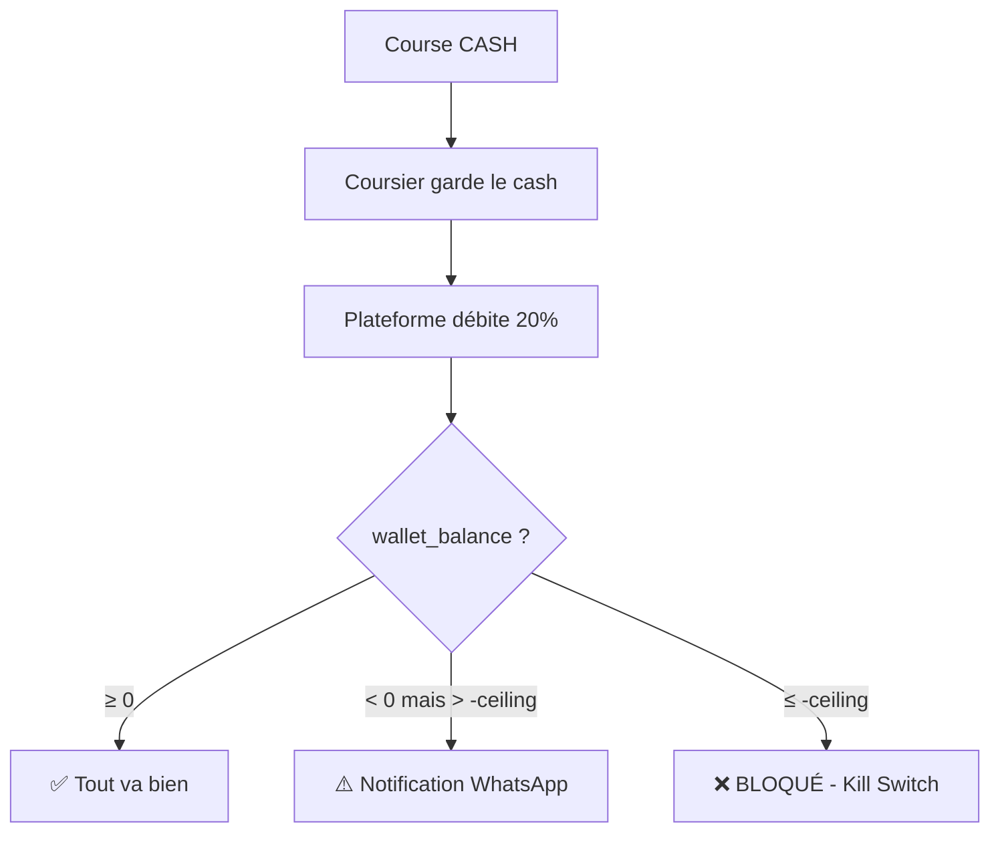

# ⚙️ Module `core/` — Utilisateurs, Auth & Gamification

> Le cœur de DELIVR-CM. Gère l'identité de chaque utilisateur, l'authentification par téléphone, et la gamification des coursiers.

---

## 🎯 Rôle en une phrase

> Tout utilisateur de la plateforme passe par `core/`. Ce module sait **qui tu es**, **ce que tu peux faire**, et **comment tu progresses**.

---

## 👥 Qui l'utilise ?

| Profil | Utilisation |
|---|---|
| 👤 CLIENT | Créé automatiquement à la première commande |
| 🛍️ BUSINESS | Inscription + gestion profil/branding |
| 🏍️ COURIER | Inscription + onboarding + gamification |
| 👑 ADMIN | Gestion utilisateurs + logs d'activité |

---

## 📦 Modèles de données

### `User` — Le modèle central

```python
class User(AbstractBaseUser, PermissionsMixin):
    # Identifiant unique = numéro WhatsApp
    phone_number   # +237XXXXXXXXX (unique)
    full_name      # Nom complet
    role           # ADMIN | CLIENT | COURIER | BUSINESS
    slug           # URL publique (auto pour BUSINESS)
    
    # Localisation
    last_location         # PointField (GPS)
    last_location_updated # DateTime
    
    # Finance
    wallet_balance  # DecimalField (peut être NÉGATIF pour les coursiers !)
    debt_ceiling    # Plafond de dette (défaut: 2500 XAF)
    
    # Business (vendeurs)
    is_business_approved  # Bool - validé par admin ?
    shop_logo             # Image
    brand_color           # Hex (#00d084)
    business_type         # SOCIAL | WEB | BOTH
    welcome_message       # Texte affiché sur la page de commande
    
    # Courier (documents)
    is_verified     # Bool - documents vérifiés ?
    cni_document    # Fichier CNI
    moto_document   # Fichier photo moto
    
    # Courier (onboarding)
    onboarding_status           # PENDING → PROBATION → APPROVED | REJECTED
    probation_start_date        # Date début probation
    probation_end_date          # Date fin probation
    probation_delivery_limit    # Max courses/jour en probation
    probation_deliveries_count  # Compteur
    trust_score                 # 0.0 à 1.0
    
    # Courier (gamification)
    courier_level                 # BRONZE | SILVER | GOLD | PLATINUM
    is_online                     # Disponible ?
    total_deliveries_completed    # Compteur
    total_distance_km             # Distance totale
    average_rating                # Note /5
    total_ratings_count           # Nb d'évaluations
    acceptance_rate               # Taux d'acceptation (%)
    cancellation_count            # Nb d'annulations
    consecutive_success_streak    # Série en cours
    best_streak                   # Record
    average_response_seconds      # Temps de réponse moyen
```

### `AdminActivityLog` — Audit des actions admin

```python
class AdminActivityLog:
    user         # Admin qui a fait l'action
    action       # CREATE | UPDATE | DELETE | APPROVE | REJECT | BLOCK | ...
    target_model # Ex: "User", "Delivery"
    target_id    # ID de l'objet ciblé
    details      # JSON avec les détails
    ip_address   # IP de l'admin
    created_at   # Timestamp
```

### `PromoCode` — Codes promotionnels

```python
class PromoCode:
    code              # Ex: "BIENVENUE2025"
    discount_type     # PERCENTAGE | FIXED
    discount_value    # 10 (%) ou 500 (XAF)
    max_uses          # 0 = illimité
    current_uses      # Compteur
    min_order_amount  # Montant minimum
    max_discount_amount # Plafond remise (%)
    valid_from        # Date début
    valid_until       # Date fin
    is_active         # Bool
```

---

## 🔄 Flux principaux

### Authentification



### Onboarding coursier



### Système de dette coursier



---

## 🔗 Dépendances

```
core/ ←─── utilisé par TOUS les autres modules
  │
  ├── logistics/   (Delivery.sender, .courier, .client)
  ├── finance/     (Transaction.user)
  ├── partners/    (PartnerAPIKey.partner)
  ├── courier/     (profil coursier + gamification)
  ├── fleet/       (gestion des coursiers)
  ├── bot/         (notifications WhatsApp par user)
  └── support/     (Dispute.creator)
```

---

## ⚠️ Points d'attention

| Règle | Détail |
|---|---|
| **Le wallet peut être négatif** | Seulement pour les `COURIER` (système de dette) |
| **Le slug est unique** | Auto-généré pour les `BUSINESS` à partir du `full_name` |
| **Kill Switch** | `wallet_balance < -debt_ceiling` → coursier bloqué automatiquement |
| **OTP = 4 chiffres** | Expire en 10 min, max 5 tentatives, lockout 15 min |
| **CNI obligatoire** | Les coursiers doivent upload leur CNI avant approbation |
| **Trust score** | Calculé automatiquement (0.0-1.0) pendant la probation |

---

*📖 Retour au [README principal](../README.md)*
