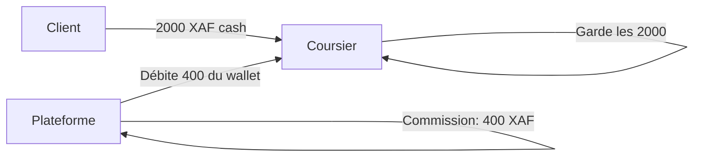
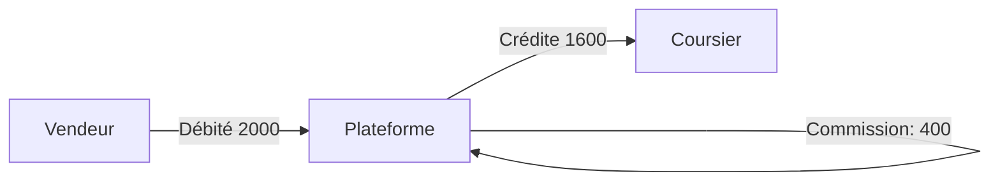
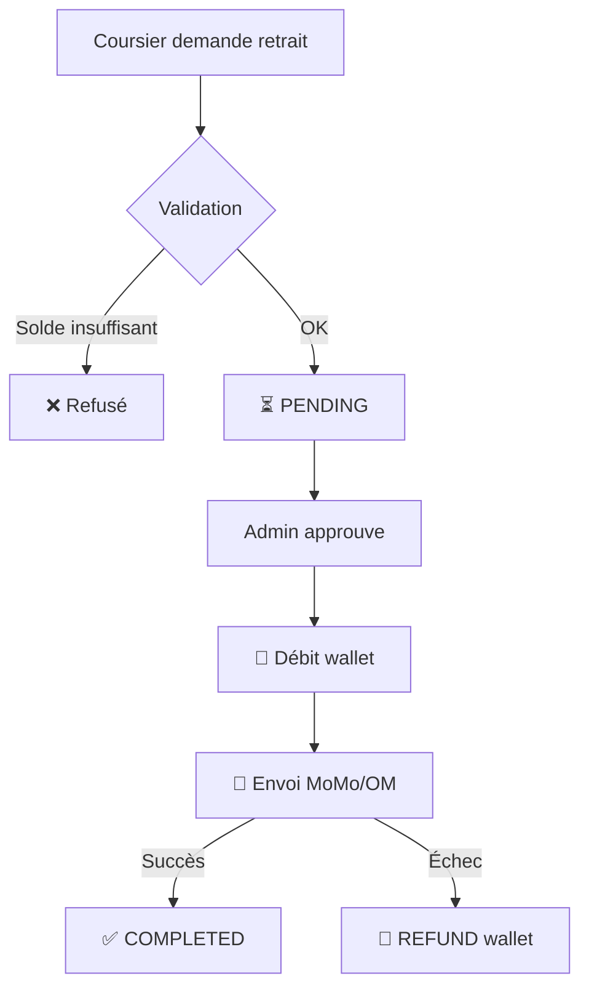

# 💰 Module `finance/` — Wallet, Transactions & Paiements

> Le système nerveux financier de DELIVR-CM. Chaque mouvement d'argent passe par ce module.

---

## 🎯 Rôle en une phrase

> Ce module sait **qui a combien**, **qui doit quoi**, et gère les **paiements Mobile Money** (MTN MoMo, Orange Money).

---

## 👥 Qui l'utilise ?

| Profil | Utilisation |
|---|---|
| 🛍️ BUSINESS | Voir son wallet, payer les livraisons prépayées |
| 🏍️ COURIER | Suivre ses gains, demander des retraits MoMo/OM |
| 👑 ADMIN | Supervision financière, approbation des retraits |

---

## 📦 Modèles de données

### `Transaction` — Journal comptable

```python
class Transaction:
    id              # UUID
    user            # FK → User
    amount          # Decimal (positif=crédit, négatif=débit)
    transaction_type  # DEPOSIT | DELIVERY_CREDIT | REFUND | 
                      # COMMISSION | WITHDRAWAL | PREPAID_DEBIT
    status          # PENDING | COMPLETED | FAILED | REVERSED
    delivery        # FK → Delivery (optionnel)
    description     # Texte libre
    reference       # Référence externe
    created_at      # Timestamp
```

### `WithdrawalRequest` — Demandes de retrait MoMo/OM

```python
class WithdrawalRequest:
    id          # UUID
    courier     # FK → User
    amount      # Montant demandé
    provider    # MTN_MOMO | ORANGE_MONEY
    phone_number # Numéro de réception
    status      # PENDING → PROCESSING → COMPLETED | FAILED | REJECTED
    
    # Admin
    approved_by  # FK → User (admin)
    approved_at  # Timestamp
    completed_at # Timestamp
    
    # Mobile Money
    external_transaction_id  # ID de la transaction MoMo/OM
    failure_reason           # Raison en cas d'échec
    
    # Limites
    MINIMUM_WITHDRAWAL = 1000    # XAF
    MAXIMUM_WITHDRAWAL = 500000  # XAF
```

### `Invoice` — Factures PDF

```python
class Invoice:
    invoice_number  # "DLV-2026-000142"
    invoice_type    # DELIVERY_RECEIPT | COURIER_STATEMENT | B2B_INVOICE
    user           # FK → User
    delivery       # FK → Delivery (optionnel)
    
    # Montants
    subtotal       # Montant HT
    tax_amount     # Taxes
    total          # Montant TTC
    commission     # Commission plateforme
    net_amount     # Net vendeur/coursier
    
    # PDF
    pdf_file       # FileField
    is_paid        # Bool
```

### `MobilePayment` — Paiements STK Push

```python
class MobilePayment:
    delivery           # FK → Delivery
    provider           # MTN | OM
    amount             # Montant
    phone_number       # Numéro du payeur
    status             # PENDING → SUCCESSFUL | FAILED | CANCELLED | TIMEOUT
    external_reference # ID fournisseur
    callback_data      # JSON du callback
```

---

## 🔄 Flux financiers

### Livraison CASH (P2P)



```
Transaction créée:
- User: Jean (coursier)
- Type: COMMISSION
- Amount: -400 XAF
- Description: "Commission livraison DLV-A7F3"
```

### Livraison PRÉPAYÉE (Wallet Marchand)



```
Transactions créées:
1. User: Marie (vendeur)  | Type: PREPAID_DEBIT    | Amount: -2000 XAF
2. User: Jean (coursier)  | Type: DELIVERY_CREDIT  | Amount: +1600 XAF
```

### Retrait Mobile Money



---

## 💼 WalletService — Operations atomiques

```python
class WalletService:
    @staticmethod
    def credit(user, amount, transaction_type, delivery=None, description=""):
        """Créditer un wallet (ajouter de l'argent)"""
        # Atomique : Transaction + update wallet_balance
        
    @staticmethod
    def debit(user, amount, transaction_type, delivery=None, 
              description="", allow_negative=False):
        """Débiter un wallet (retirer de l'argent)"""
        # allow_negative=True pour les coursiers (système de dette)
        
    @staticmethod
    def process_cash_delivery(delivery):
        """Traiter une livraison CASH : débiter la commission du coursier"""
        
    @staticmethod
    def process_prepaid_delivery(delivery):
        """Traiter une livraison PRÉPAYÉE : créditer le coursier"""
        
    @staticmethod
    def debit_business_for_order(business, delivery):
        """Débiter le vendeur à la création d'une commande prépayée"""
```

---

## 💳 Paiements Mobile Money

### Détection automatique du fournisseur

```python
# MTN: 67x, 650-654, 68x
# Orange: 69x, 655-659

MobilePayment.detect_provider("677123456")  # → MTN_MOMO
MobilePayment.detect_provider("699123456")  # → ORANGE_MONEY
```

### Flux de paiement

```
1. Client choisit "Payer par Mobile Money"
2. Système détecte MTN ou Orange via le numéro
3. STK Push envoyé sur le téléphone du client
4. Client confirme sur son téléphone
5. Callback reçu de MTN/Orange
6. Statut mis à jour → SUCCESSFUL
7. Livraison créée
```

---

## 🌐 URLs

### Portail vendeur
| URL | Description |
|---|---|
| `/partners/wallet/` | Wallet du vendeur + historique |
| `/partners/invoices/` | Factures téléchargeables |

### App coursier
| URL | Description |
|---|---|
| `/courier/wallet/` | Wallet + demande de retrait |
| `/courier/wallet/history/` | Historique des transactions |

### Fleet Manager
| URL | Description |
|---|---|
| `/fleet/withdrawals/` | Gestion des demandes de retrait |
| `/fleet/finance/` | Dashboard financier global |

### API
| Endpoint | Description |
|---|---|
| `/api/v1/payments/initiate/` | Initier un paiement MoMo/OM |
| `/api/v1/payments/<id>/status/` | Vérifier le statut |
| `/api/v1/payments/callback/mtn/` | Webhook callback MTN |
| `/api/v1/payments/callback/orange/` | Webhook callback Orange |

---

## ⚠️ Points d'attention

| Règle | Détail |
|---|---|
| **Atomicité** | Toutes les opérations wallet utilisent `transaction.atomic()` |
| **allow_negative** | Seuls les coursiers peuvent avoir un wallet négatif |
| **Min/Max retrait** | 1 000 → 500 000 XAF |
| **Approbation admin** | Les retraits nécessitent une validation manuelle |
| **Factures auto** | Générées automatiquement à la complétion d'une livraison |
| **Detect provider** | Le fournisseur MoMo/OM est détecté via les préfixes téléphone |

---

*📖 Retour au [README principal](../README.md)*
