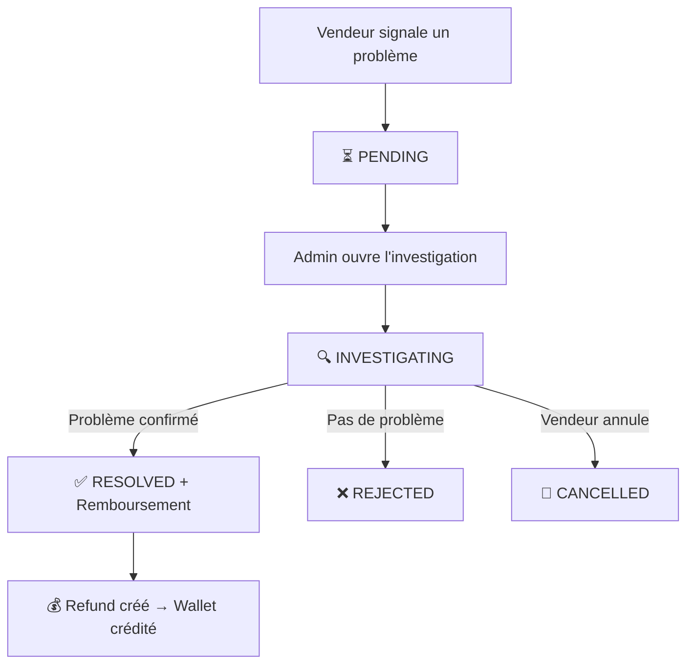

# ⚖️ Module `support/` — Litiges & Remboursements

> Gestion des problèmes post-livraison. Investigation, résolution et remboursement.

---

## 🎯 Rôle en une phrase

> Ce module permet aux vendeurs de **signaler un problème**, à l'équipe DELIVR-CM d'**enquêter**, et de **rembourser** si nécessaire.

---

## 📦 Modèles

### `Dispute` — Litige
```python
class Dispute:
    delivery          # FK → Delivery
    creator           # FK → User (vendeur)
    reason            # ITEM_NOT_RECEIVED | ITEM_DAMAGED | ITEM_MISMATCH | 
                      # OVERCHARGED | COURIER_CONDUCT | OTHER
    description       # Détail du problème
    status            # PENDING → INVESTIGATING → RESOLVED | REJECTED | CANCELLED
    photo_evidence    # Image de preuve
    resolution_note   # Note de résolution (admin)
    resolved_by       # FK → User (admin)
    resolved_at       # Timestamp
    refund_amount     # Montant remboursé
```

### `Refund` — Remboursement
```python
class Refund:
    dispute      # FK → Dispute (one-to-one)
    user         # FK → User (bénéficiaire)
    amount       # Montant remboursé
    transaction  # FK → Transaction (trace comptable)
    status       # PENDING → COMPLETED | FAILED
    reason       # Raison du remboursement
```

---

## 🔄 Flux de litige



---

## 🌐 URLs

| URL | Description |
|---|---|
| `/partners/disputes/` | Liste des litiges du vendeur |
| `/partners/disputes/new/<order_id>/` | Créer un litige pour une commande |
| `/partners/disputes/<id>/` | Détail et suivi du litige |

---

*📖 Retour au [README principal](../README.md)*
